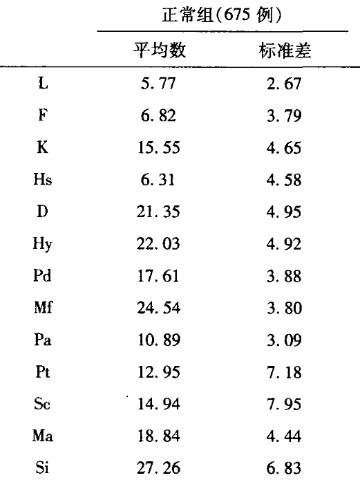
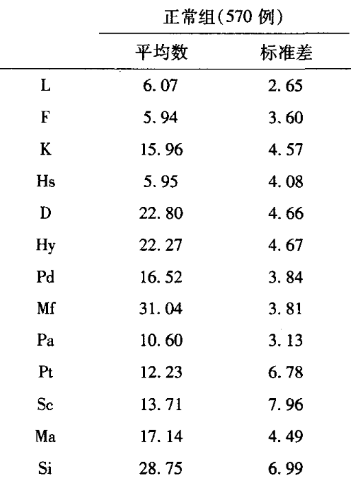
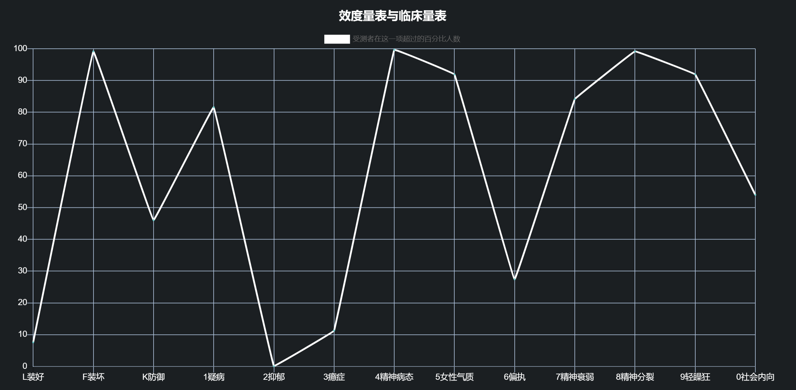
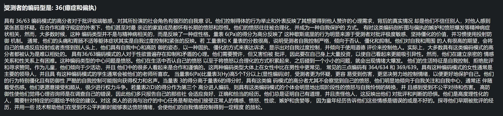
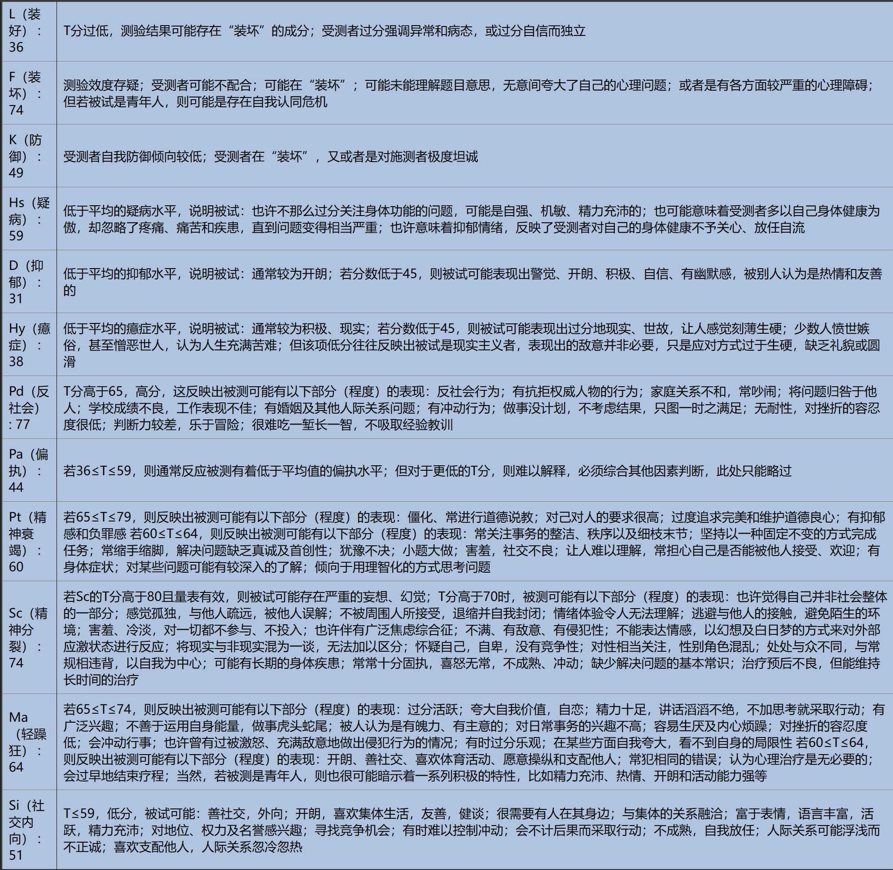

# 更适合中国宝宝体质的精神心理测试
本测试基于mmpi-2，自主汉化，使用中国常模作为计分标准，提供了百分比数据，并查阅了许多学术资料提供了详尽的编码型解析。  ps：测试完全免费！！！

[框架来源](https://github.com/MMPI-CHN/MMPI-CHN.github.io) (UI基本都是沿用他的，但是其他地方比如题目翻译，常模，剖面图，结果解析都重写了）

--------------------------------------------------------
首先，最关键的问题，我的中国常模是哪来的？因为常模数据一般是不公开的，我在市面上见过的mmpi-2测试都是基于美国常模的，无一例外，而中国常模数据一般只有医院，研究所这些才会有。而美国常模的最大问题当然是不准，尤其是在量表F，量表2(抑郁)，量表8(精分)这几个维度我们如果用美国常模会明显偏高。

所以我尝试在网上找有没有学术文章公布了常模，大概看了这些[1](https://www.zhangqiaokeyan.com/detail/0201227032509.html)[2](https://www.zhangqiaokeyan.com/detail/020121005674.html)[3](https://www.zhangqiaokeyan.com/detail/02012103952420.html)[4](https://www.zhangqiaokeyan.com/detail/0201231787655.html)[5](https://www.zhangqiaokeyan.com/detail/0201223596851.html),最后终于在一个对比正常人和精分患者的mmpi-2结果的论文里找到了常模数据[6](https://www.zhangqiaokeyan.com/detail/0201237619888.html)。这个常模调查了正常人1245例，男女人数差不多，从初中到硕士以上学历也都有，可信度还是不错的。


--------------------------------------------------------
然后我发现一个问题，mmpi得到的分数都是正态分布的分，T分几乎有80%都在40~60之间，这样并不直观，能不能把正态分布分转换成百分比呢？答案是可以的，只是需要一点简单的数学技巧，具体可以看代码。
```javascript
  // 使用正态分布的累积分布函数（CDF）来计算百分比
  function calculatePercentile(tScore) {
    // 使用Z分数公式将T分数转换为Z分数
    let zScore = (tScore - 50) / 10;
    // 使用Z分数查找正态分布表或使用错误函数(erf)来计算百分比
    let percentile = (1 + erf(zScore / Math.sqrt(2))) / 2;
    return percentile * 100; // 转换为百分比
  }

  // 计算每个T分数的百分比并存储到新数组中
  tscoreArray.forEach(tScore => { 
    percentileArray.push(calculatePercentile(tScore).toFixed(2));
  });

// 错误函数(erf)的实现
  function erf(x) { 
  // 使用近似公式计算erf
    const a1 =  0.254829592;
    const a2 = -0.284496736;
    const a3 =  1.421413741;
    const a4 = -1.453152027;
    const a5 =  1.061405429;
    const p  =  0.3275911;

    const t = 1.0 / (1.0 + p * x);
    const y = 1.0 - (((((a5 * t + a4) * t) + a3) * t + a2) * t + a1) * t * Math.exp(-x * x);
    return y;
  }
```
经过一大堆神秘数字的转换，最后量表数据也变得更加直观了。



另外值得一说的是，我对370道题都进行了汉化。举个例子：
```
312. The only interesting part of newspapers is the comic strips.
直译：报纸上唯一有趣的就是连环漫画。
```
如果现在是20世纪末那么这个题还不错，但是这是2024的中国，谁还看报纸啊。
所以最后我把它翻成了：
```
意译：玩手机时，我喜欢刷视频而不喜欢阅读。
```

我认为这个题的主要出题意图是看受测者有没有失去专注力，是否比起文字更喜欢图像，所以选择了这样的意译，总之见仁见智吧~

-------------------------------------------------------
还有工作量最大的一点，其实还是对于剖面图的解析，我这里采用了两点编码型，但是有10个临床量表两两组合构成编码型，还是有很多的编码，并且这个需要参考大量的书籍里对编码型的解读，这是一个示例。


这是最后对每个维度的常规说明。
